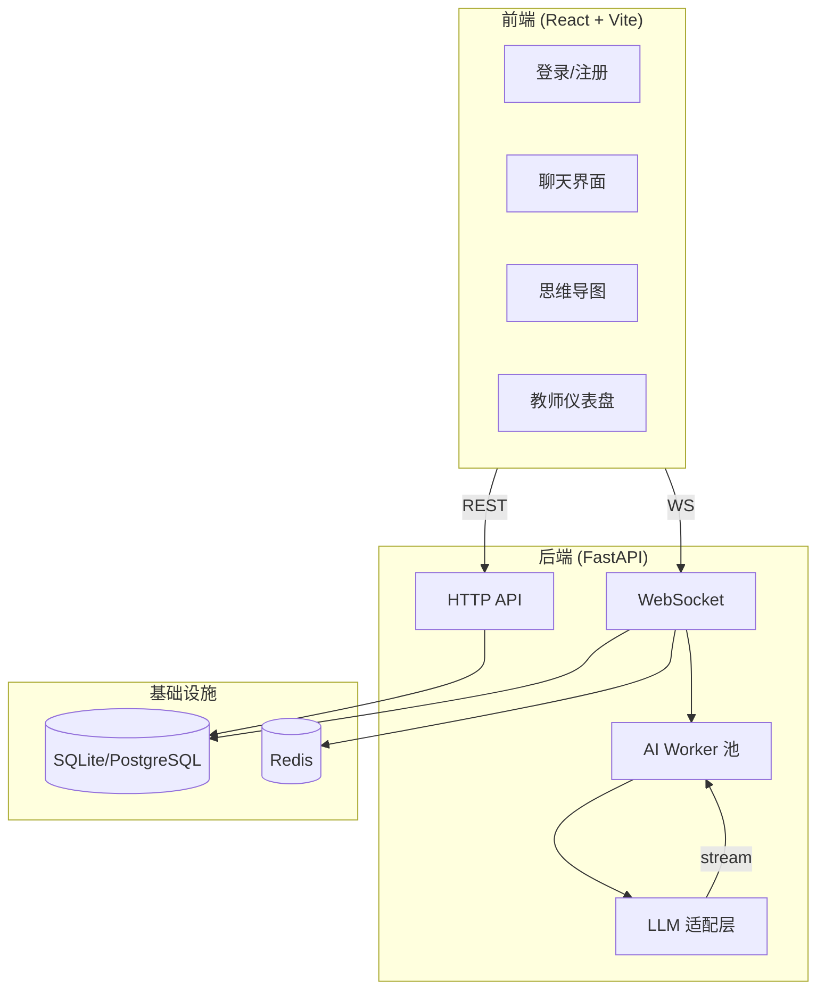

# CoThink AI — 协作思维教学平台

> 基于 AI 支架的协作学习系统，支持学生-AI 对话、思维导图自动生成、教师实时监控。

---

## 技术栈

| 层 | 技术 |
|----|------|
| **后端** | Python 3.11 · FastAPI · SQLAlchemy 2 (async) · WebSocket |
| **前端** | React 18 · TypeScript · Zustand · React Flow · Vite |
| **数据库** | SQLite（开发） / PostgreSQL 16（生产） |
| **缓存** | Redis（可选，无 Redis 自动降级） |
| **AI** | 多 LLM 适配（DeepSeek / Kimi / 通义 / 智谱 / 豆包 / OpenAI） |
| **部署** | Docker Compose · Nginx · GitHub Actions CI |

---

## 系统架构



---

## 项目结构

```
cothink/
├── backend/
│   ├── app/
│   │   ├── main.py              # FastAPI 入口 + lifespan
│   │   ├── core/                # 配置 / JWT / 依赖注入
│   │   ├── models/              # SQLAlchemy 模型 (9 个)
│   │   ├── routers/             # HTTP API (6 个路由模块)
│   │   ├── schemas/             # Pydantic 请求/响应模型
│   │   ├── websockets/          # WS 路由 + 分发器 + 事件处理
│   │   ├── llm/                 # 多 LLM 工厂 + OpenAI 兼容客户端
│   │   ├── infra/               # Redis / AI 队列 / Worker
│   │   └── db/                  # 数据库会话 + 种子数据
│   ├── tests/                   # pytest 测试 (25 用例)
│   │   ├── unit/                # 单元测试
│   │   └── integration/         # API 集成测试
│   ├── Dockerfile
│   ├── requirements.txt
│   └── .env.example
├── frontend/
│   ├── src/
│   │   ├── store/               # Zustand Store (5 切片)
│   │   ├── hooks/               # WebSocket hook
│   │   ├── components/          # UI 组件
│   │   ├── api/                 # axios 封装
│   │   └── types/               # TypeScript 类型
│   └── vite.config.ts
├── docker-compose.yml
└── .github/workflows/ci.yml
```

---

## 快速启动

### 环境要求

- Python ≥ 3.11
- Node.js ≥ 20
- Redis（可选）

### 1. 后端

```bash
cd cothink/backend
cp .env.example .env          # 编辑 .env，填入 DEEPSEEK_API_KEY
pip install -r requirements.txt
python -m uvicorn app.main:app --host 0.0.0.0 --port 8000 --reload
```

### 2. 前端

```bash
cd cothink/frontend
npm install
npm run dev                    # → http://localhost:5173
```

### 3. 运行测试

```bash
cd cothink/backend
pip install pytest pytest-asyncio httpx
python -m pytest tests/ -v
```

---

## 配置说明

| 环境变量 | 默认值 | 说明 |
|----------|--------|------|
| `DB_URL` | `sqlite+aiosqlite:///./cothink.db` | 数据库连接 |
| `REDIS_URL` | `redis://localhost:6379/0` | Redis 地址 |
| `DEEPSEEK_API_KEY` | — | **必填** |
| `JWT_SECRET` | `cothink-secret-change-me` | 生产必改 |
| `LLM_MAX_CONCURRENCY` | `10` | 最大并发 LLM 请求 |
| `CONTEXT_WINDOW_SIZE` | `10` | AI 对话历史上下文条数 |
| `KIMI_API_KEY` / `TONGYI_API_KEY` / ... | — | 可选 LLM Provider |

---

## API 接口

### 认证

| 方法 | 路径 | 说明 |
|------|------|------|
| POST | `/auth/register` | 注册（学生/教师） |
| POST | `/auth/login` | 登录 |
| GET | `/auth/me` | 获取当前用户 |

### 支架管理

| 方法 | 路径 | 说明 | 权限 |
|------|------|------|------|
| GET | `/scaffolds` | 列出所有支架 | 公开 |
| POST | `/scaffolds` | 创建支架 | 教师 |
| PATCH | `/scaffolds/{id}` | 更新支架 | 教师 |

### 小组

| 方法 | 路径 | 说明 |
|------|------|------|
| POST | `/groups` | 创建小组 |
| POST | `/groups/{id}/join` | 加入小组 |
| GET | `/groups` | 列出小组 |

### 教师端

| 方法 | 路径 | 说明 | 权限 |
|------|------|------|------|
| GET | `/teacher/stats` | 仪表盘统计 | 教师 |
| GET | `/teacher/students` | 学生列表 | 教师 |
| GET | `/teacher/messages` | 消息日志 | 教师 |
| GET | `/teacher/sessions` | 会话列表 | 教师 |
| GET | `/teacher/assignments` | 作业列表 | 教师 |

### 名单导入

| 方法 | 路径 | 说明 | 权限 |
|------|------|------|------|
| POST | `/roster/import` | XLSX 批量导入学生 | 教师 |

### LLM

| 方法 | 路径 | 说明 |
|------|------|------|
| GET | `/llm/providers` | 可用模型列表 |

### WebSocket

连接地址：`ws://host:8000/ws/{session_id}?token=JWT`

| 事件 | 方向 | 说明 |
|------|------|------|
| `CHAT_SEND` | → 服务器 | 发送消息 |
| `CHAT_MESSAGE` | ← 服务器 | 接收消息 |
| `AI_TYPING` | ← 服务器 | AI 打字状态 |
| `AI_STREAM_CHUNK` | ← 服务器 | AI 流式回复片段 |
| `SCAFFOLD_SET_ACTIVE` | → 服务器 | 教师激活支架 |
| `SCAFFOLD_STATE_UPDATE` | ← 服务器 | 支架状态变更 |
| `MINDMAP_GENERATE` | → 服务器 | 请求生成思维导图 |
| `MINDMAP_DATA` | ← 服务器 | 思维导图数据 |
| `MINDMAP_EDIT` | ↔ 双向 | 编辑同步 |

---

## 部署

### Docker Compose（推荐）

```bash
cd cothink
# 编辑 backend/.env（参考 .env.example）
docker compose up -d --build

# 验证
curl http://localhost:8000/llm/providers
```

### 阿里云 ECS

推荐 2 核 4G Ubuntu 22.04（~88 元/月）。详细步骤：

1. 安装 Docker + Docker Compose + Nginx
2. 克隆代码到 `/opt/cothink`
3. 配置 `.env`（PostgreSQL + Redis + JWT_SECRET）
4. `docker compose up -d --build`
5. 配置 Nginx 反向代理（HTTP + WebSocket）
6. Certbot 配置 HTTPS

### 前端 Vercel 部署

1. GitHub 关联 Vercel
2. Build Command: `cd frontend && npm run build`
3. 环境变量: `VITE_API_URL=https://你的域名`

---

## 开发指南

### 添加新 LLM Provider

1. 在 `backend/app/core/config.py` 添加 `xxx_api_key` 字段
2. 在 `backend/app/llm/factory.py` 的 `_PROVIDER_REGISTRY` 注册新 Provider
3. 在 `.env` 中配置 API Key

### 添加新 WebSocket 事件

1. 在 `backend/app/websockets/handlers/` 添加处理函数
2. 在 `backend/app/websockets/dispatcher.py` 注册事件名 → 处理函数映射

### 运行测试

```bash
cd backend
python -m pytest tests/ -v              # 全部测试
python -m pytest tests/unit/ -v         # 仅单元测试
python -m pytest tests/integration/ -v  # 仅集成测试
```

---

## License

MIT
